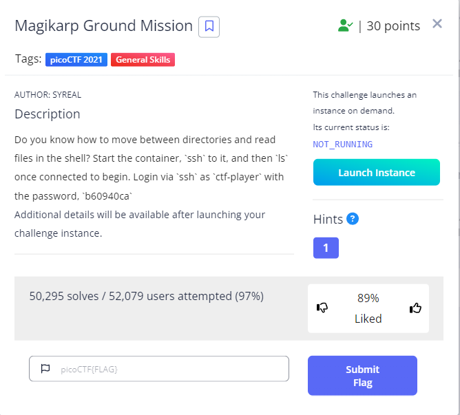

# Magikarp Ground Mission

Category : General Skills

Point : 30



# Description

Do you know how to move between directories and read files in the shell? Start the container, `ssh` to it, and then `ls` once connected to begin. Login via `ssh` as `ctf-player` with the password, `b60940ca`
Additional details will be available after launching your challenge instance.

# Solve 

Pertama saya klik launch instance lalu masukkan ssh 

```console
┌──(rinto㉿LAPTOP-LUUOMDHF)-[~]
└─$ ssh ctf-player@venus.picoctf.net -p 58191
ctf-player@venus.picoctf.net's password: 
Welcome to Ubuntu 18.04.5 LTS (GNU/Linux 5.4.0-1041-aws x86_64)

 * Documentation:  https://help.ubuntu.com
 * Management:     https://landscape.canonical.com
 * Support:        https://ubuntu.com/advantage
This system has been minimized by removing packages and content that are
not required on a system that users do not log into.

To restore this content, you can run the 'unminimize' command.

The programs included with the Ubuntu system are free software;
the exact distribution terms for each program are described in the
individual files in /usr/share/doc/*/copyright.

Ubuntu comes with ABSOLUTELY NO WARRANTY, to the extent permitted by
applicable law.
```

setelah berhasil masuk coba saya cari flag nya 

## step 1
```console
ctf-player@pico-chall$ ls
1of3.flag.txt  instructions-to-2of3.txt
ctf-player@pico-chall$ cat 1of3.flag.txt
picoCTF{xxsh_
ctf-player@pico-chall$ cat instructions-to-2of3.txt
Next, go to the root of all things, more succinctly `/`
```

## step 2
```console
ctf-player@pico-chall$ cd /
ctf-player@pico-chall$ ls
2of3.flag.txt  dev   instructions-to-3of3.txt  media  proc  sbin  tmp
bin            etc   lib                       mnt    root  srv   usr
boot           home  lib64                     opt    run   sys   var
ctf-player@pico-chall$ cat 2of3.flag.txt 
0ut_0f_\/\/4t3r_
ctf-player@pico-chall$ cat instructions-to-3of3.txt
Lastly, ctf-player, go home... more succinctly `~`
```

## step 3
```console
ctf-player@pico-chall$ cd ~
ctf-player@pico-chall$ ls
3of3.flag.txt  drop-in
ctf-player@pico-chall$ cat 3of3.flag.txt
c1754242}
```
**picoCTF{xxsh_0ut_0f_\/\/4t3r_c1754242}**
