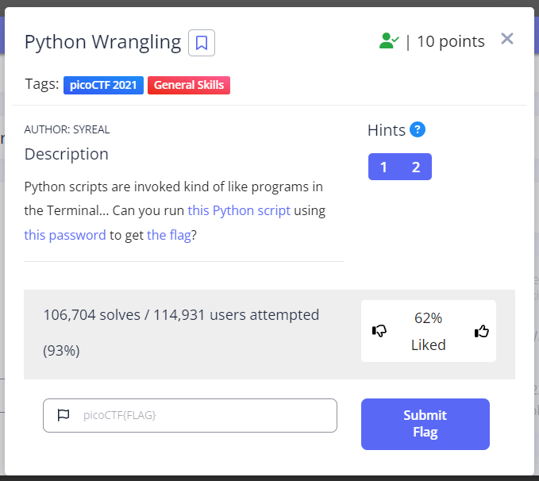

# Python Wrangling

Category : General Skills

Points : 5



## Description

Python scripts are invoked kind of like programs in the Terminal... Can you run this Python script using this password to get the flag?

## Solve 

challange ini cocok untuk pengenalan tentang python.

pertama kita download dulu lampirannya 

```console
┌──(rinto㉿LAPTOP-LUUOMDHF)-[~/CTF/pico/python_wrangling]
└─$ wget https://mercury.picoctf.net/static/b351a89e0bc6745b00716849105f8
7c6/ende.py
┌──(rinto㉿LAPTOP-LUUOMDHF)-[~/CTF/pico/python_wrangling]
└─$ wget https://mercury.picoctf.net/static/b351a89e0bc6745b00716849105f8
7c6/pw.txt
┌──(rinto㉿LAPTOP-LUUOMDHF)-[~/CTF/pico/python_wrangling]
└─$ wget https://mercury.picoctf.net/static/b351a89e0bc6745b00716849105f8
7c6/flag.txt.en
```

setelah itu kita jalankan file python nya dan tidak lupa dengan text flagnya.

```console
┌──(rinto㉿LAPTOP-LUUOMDHF)-[~/CTF/pico/python_wrangling]
└─$ python3 ende.py -d flag.txt.en 
Please enter the password:67c6cc9667c6cc9667c6cc9667c6cc96
picoCTF{4p0110_1n_7h3_h0us3_67c6cc96}
```

**picoCTF{4p0110_1n_7h3_h0us3_67c6cc96}**


