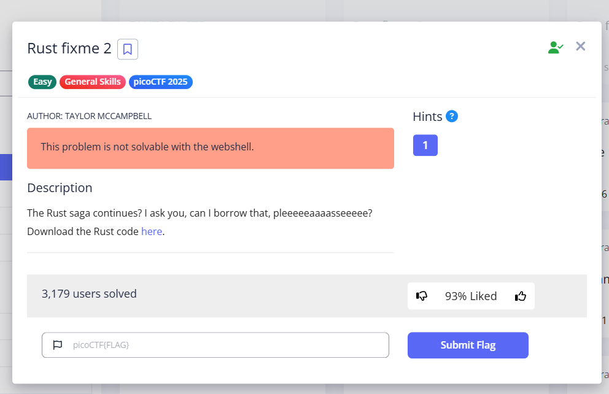

# Rust fixme 2

Category : General Skills



# Description

The Rust saga continues? I ask you, can I borrow that, pleeeeeaaaasseeeee?
Download the Rust code here.

# Solve 

Pertama saya download file nya terlebih dahulu

```console
┌──(rinto㉿LAPTOP-LUUOMDHF)-[~/CTF/picoRinto2/Rust-fixme2]
└─$ wget https://challenge-files.picoctf.net/c_verbal_sleep/babfbee79718a6363826ba86300173ffde6d81577e9dd07d4130c53a7eecf6c3/fixme2.tar.gz
--2025-03-24 08:50:49--  https://challenge-files.picoctf.net/c_verbal_sleep/babfbee79718a6363826ba86300173ffde6d81577e9dd07d4130c53a7eecf6c3/fixme2.tar.gz
Resolving challenge-files.picoctf.net (challenge-files.picoctf.net)... 18.67.175.95, 18.67.175.86, 18.67.175.73, ...
Connecting to challenge-files.picoctf.net (challenge-files.picoctf.net)|18.67.175.95|:443... connected.
HTTP request sent, awaiting response... 200 OK
Length: 1585 (1.5K) [application/octet-stream]
Saving to: 'fixme2.tar.gz'

fixme2.tar.gz                             100%[===================================================================================>]   1.55K  --.-KB/s    in 0s      

2025-03-24 08:50:50 (26.7 MB/s) - 'fixme2.tar.gz' saved [1585/1585]
```

setelah berhasil di download saya setup rust nya terlebih dahulu

## Setup
```console
┌──(rinto㉿LAPTOP-LUUOMDHF)-[~]
└─$ curl --proto '=https' --tlsv1.2 https://sh.rustup.rs -sSf | sh
```

```console
┌──(rinto㉿LAPTOP-LUUOMDHF)-[~]
└─$ cp -r fixme2 /tmp/rust_proj2
```
```console
┌──(rinto㉿LAPTOP-LUUOMDHF)-[~]
└─$ cd/tmp/rust_proj2
```

setelah di setup mari kita jalankan 

## build cargo
```console
┌──(rinto㉿LAPTOP-LUUOMDHF)-[/tmp/rust_proj2]
└─$ cargo build
   Compiling crossbeam-utils v0.8.20
   Compiling rayon-core v1.12.1
   Compiling either v1.13.0
   Compiling crossbeam-epoch v0.9.18
   Compiling crossbeam-deque v0.8.5
   Compiling rayon v1.10.0
   Compiling xor_cryptor v1.2.3
   Compiling rust_proj v0.1.0 (/tmp/rust_proj2)
error[E0596]: cannot borrow *borrowed_string as mutable, as it is behind a & reference
 --> src/main.rs:9:5
  |
9 |     borrowed_string.push_str("PARTY FOUL! Here is your flag: ");
  |     ^^^^^^^^^^^^^^^ borrowed_string is a & reference, so the data it refers to cannot be borrowed as mutable
  |
help: consider changing this to be a mutable reference
  |
3 | fn decrypt(encrypted_buffer:Vec<u8>, borrowed_string: &mut String){ // How do we pass values to a function that we want to change?
  |                                                        +++

error[E0596]: cannot borrow *borrowed_string as mutable, as it is behind a & reference
  --> src/main.rs:20:5
   |
20 |     borrowed_string.push_str(&String::from_utf8_lossy(&decrypted_buffer));
   |     ^^^^^^^^^^^^^^^ borrowed_string is a & reference, so the data it refers to cannot be borrowed as mutable
   |
help: consider changing this to be a mutable reference
   |
3  | fn decrypt(encrypted_buffer:Vec<u8>, borrowed_string: &mut String){ // How do we pass values to a function that we want to change?
   |                                                        +++

For more information about this error, try rustc --explain E0596.
error: could not compile rust_proj (bin "rust_proj") due to 2 previous errors
```

setelah dijalankan ternyata ada error yang terjadi yang harus dilakukan adalah dengan membuka main.rs di folder src

## main.rs
```console
use xor_cryptor::XORCryptor;

fn decrypt(encrypted_buffer:Vec<u8>, borrowed_string: &String){ // How do we pass values to a function that we want to change?

    // Key for decryption
    let key = String::from("CSUCKS");

    // Editing our borrowed value
    borrowed_string.push_str("PARTY FOUL! Here is your flag: ");

    // Create decrpytion object
    let res = XORCryptor::new(&key);
    if res.is_err() {
        return; // How do we return in rust?
    }
    let xrc = res.unwrap();

    // Decrypt flag and print it out
    let decrypted_buffer = xrc.decrypt_vec(encrypted_buffer);
    borrowed_string.push_str(&String::from_utf8_lossy(&decrypted_buffer));
    println!("{}", borrowed_string);
}


fn main() {
    // Encrypted flag values
    let hex_values = ["41", "30", "20", "63", "4a", "45", "54", "76", "01", "1c", "7e", "59", "63", "e1", "61", "25", "0d", "c4", "60", "f2", "12", "a0", "18", "03", "51", "03", "36", "05", "0e", "f9", "42", "5b"];

    // Convert the hexadecimal strings to bytes and collect them into a vector
    let encrypted_buffer: Vec<u8> = hex_values.iter()
        .map(|&hex| u8::from_str_radix(hex, 16).unwrap())
        .collect();

    let party_foul = String::from("Using memory unsafe languages is a: "); // Is this variable changeable?
    decrypt(encrypted_buffer, &party_foul); // Is this the correct way to pass a value to a function so that it can be changed?
}
```

setelah dilihat tenyata ada satu kesalahan dalam koding an tersbut yaitu kurang nya mutable references

## Final main.rs
```console
use xor_cryptor::XORCryptor;

fn decrypt(encrypted_buffer:Vec<u8>, borrowed_string: &mut String){ // How do we pass values to a function that we want to change?

    // Key for decryption
    let key = String::from("CSUCKS");

    // Editing our borrowed value
    borrowed_string.push_str("PARTY FOUL! Here is your flag: ");

    // Create decrpytion object
    let res = XORCryptor::new(&key);
    if res.is_err() {
        return; // How do we return in rust?
    }
    let xrc = res.unwrap();

    // Decrypt flag and print it out
    let decrypted_buffer = xrc.decrypt_vec(encrypted_buffer);
    borrowed_string.push_str(&String::from_utf8_lossy(&decrypted_buffer));
    println!("{}", borrowed_string);
}


fn main() {
    // Encrypted flag values
    let hex_values = ["41", "30", "20", "63", "4a", "45", "54", "76", "01", "1c", "7e", "59", "63", "e1", "61", "25", "0d", "c4", "60", "f2", "12", "a0", "18", "03", "51", "03", "36", "05", "0e", "f9", "42", "5b"];

    // Convert the hexadecimal strings to bytes and collect them into a vector
    let encrypted_buffer: Vec<u8> = hex_values.iter()
        .map(|&hex| u8::from_str_radix(hex, 16).unwrap())
        .collect();

    let mut party_foul = String::from("Using memory unsafe languages is a: "); // Is this variable changeable?
    decrypt(encrypted_buffer, &mut party_foul); // Is this the correct way to pass a value to a function so that it can be changed?
}
```
setelah itu kita cargo build lagi 

```console
┌──(rinto㉿LAPTOP-LUUOMDHF)-[/tmp/rust_proj2/src]
└─$ cargo build                                                                                                                                                     
   Compiling rust_proj v0.1.0 (/tmp/rust_proj2)
    Finished dev profile [unoptimized + debuginfo] target(s) in 21.76s
```

setelah berhasil kita jalankan lagi dan kita akan menemukan flag nya

```console
──(rinto㉿LAPTOP-LUUOMDHF)-[/tmp/rust_proj2/src]
└─$ cargo run                                                                                                                                                         
    Finished dev profile [unoptimized + debuginfo] target(s) in 0.23s
     Running /tmp/rust_proj2/target/debug/rust_proj
Using memory unsafe languages is a: PARTY FOUL! Here is your flag: picoCTF{4r3_y0u_h4v1n5_fun_y31?}
```

**picoCTF{4r3_y0u_h4v1n5_fun_y31?}**
