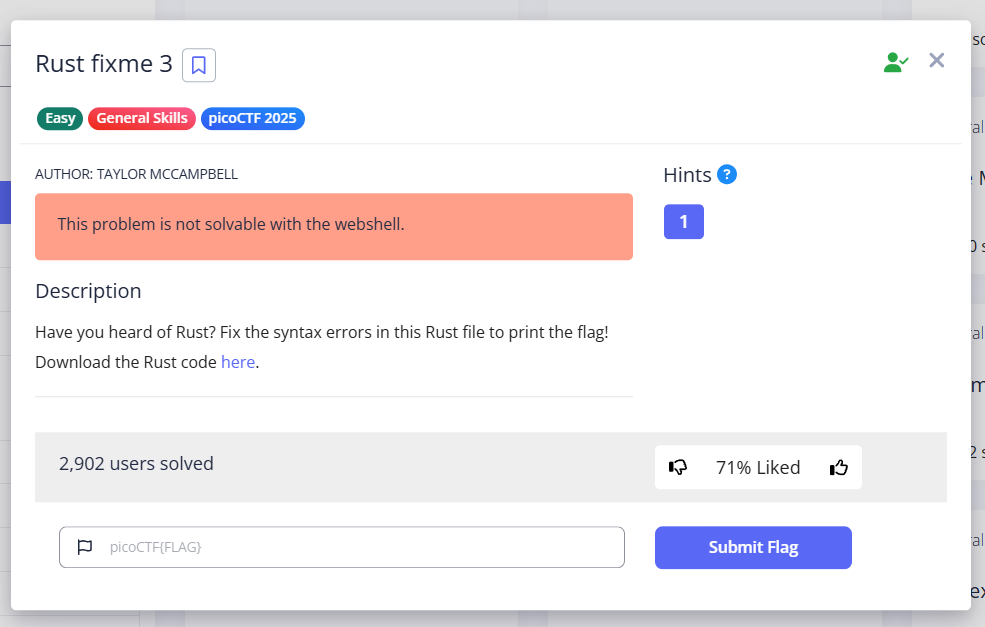

# Rust fixme 3

Category : General Skills



# Description

Have you heard of Rust? Fix the syntax errors in this Rust file to print the flag!
Download the Rust code here.

# Solve 

Pertama saya download file nya terlebih dahulu

```console
┌──(rinto㉿LAPTOP-LUUOMDHF)-[~]
└─$ wget https://challenge-files.picoctf.net/c_verbal_sleep/dcdaf491b35c1d0f5075e9583edbbb7aaea1dffb6ad32bc000e4d87b5200ff7b/fixme3.tar.gz                             
--2025-03-18 14:56:21--  https://challenge-files.picoctf.net/c_verbal_sleep/dcdaf491b35c1d0f5075e9583edbbb7aaea1dffb6ad32bc000e4d87b5200ff7b/fixme3.tar.gz
Resolving challenge-files.picoctf.net (challenge-files.picoctf.net)... 18.67.175.73, 18.67.175.95, 18.67.175.23, ...
Connecting to challenge-files.picoctf.net (challenge-files.picoctf.net)|18.67.175.73|:443... connected.
HTTP request sent, awaiting response... 200 OK
Length: 1776 (1.7K) [application/octet-stream]
Saving to: 'fixme3.tar.gz'

fixme3.tar.gz                             100%[====================================================================================>]   1.73K  --.-KB/s    in 0s      

2025-03-18 14:56:23 (28.9 MB/s) - 'fixme3.tar.gz' saved [1776/1776]
```

setelah berhasil di download saya setup rust nya terlebih dahulu

## Setup
```console
┌──(rinto㉿LAPTOP-LUUOMDHF)-[~]
└─$ curl --proto '=https' --tlsv1.2 https://sh.rustup.rs -sSf | sh
```

```console
┌──(rinto㉿LAPTOP-LUUOMDHF)-[~]
└─$ cp -r fixme3 /tmp/rust_proj
```
```console
┌──(rinto㉿LAPTOP-LUUOMDHF)-[~]
└─$ cd/tmp/rust_proj
```

setelah di setup saya mari kita jalankan 

## build cargo
```console
┌──(rinto㉿LAPTOP-LUUOMDHF)-[/tmp/rust_proj]
└─$ cargo build                                                                                                                                                        
    Updating crates.io index
  Downloaded either v1.13.0
  Downloaded xor_cryptor v1.2.3
  Downloaded crossbeam-epoch v0.9.18
  Downloaded crossbeam-deque v0.8.5
  Downloaded crossbeam-utils v0.8.20
  Downloaded rayon-core v1.12.1
  Downloaded rayon v1.10.0
  Downloaded 7 crates (388.2 KB) in 1.75s
   Compiling crossbeam-utils v0.8.20
   Compiling rayon-core v1.12.1
   Compiling either v1.13.0
   Compiling crossbeam-epoch v0.9.18
   Compiling crossbeam-deque v0.8.5
   Compiling rayon v1.10.0
   Compiling xor_cryptor v1.2.3
   Compiling rust_proj v0.1.0 (/tmp/rust_proj)
error[E0133]: call to unsafe function std::slice::from_raw_parts is unsafe and requires unsafe function or block
  --> src/main.rs:31:31
   |
31 |         let decrypted_slice = std::slice::from_raw_parts(decrypted_ptr, decrypted_len);
   |                               ^^^^^^^^^^^^^^^^^^^^^^^^^^^^^^^^^^^^^^^^^^^^^^^^^^^^^^^^ call to unsafe function
   |
   = note: consult the function's documentation for information on how to avoid undefined behavior

For more information about this error, try rustc --explain E0133.
error: could not compile rust_proj (bin "rust_proj") due to 1 previous error
```

setelah dijalankan ternyata ada error yang terjadi yang harus dilakukan adalah dengan membuka main.rs di folder src

## main.rs
```console
use xor_cryptor::XORCryptor;

fn decrypt(encrypted_buffer: Vec<u8>, borrowed_string: &mut String) {
    // Key for decryption
    let key = String::from("CSUCKS");

    // Editing our borrowed value
    borrowed_string.push_str("PARTY FOUL! Here is your flag: ");

    // Create decryption object
    let res = XORCryptor::new(&key);
    if res.is_err() {
        return;
    }
    let xrc = res.unwrap();

    // Did you know you have to do "unsafe operations in Rust?
    // https://doc.rust-lang.org/book/ch19-01-unsafe-rust.html
    // Even though we have these memory safe languages, sometimes we need to do things outside of the rules
    // This is where unsafe rust comes in, something that is important to know about in order to keep things in perspective
    
    // unsafe {
        // Decrypt the flag operations 
        let decrypted_buffer = xrc.decrypt_vec(encrypted_buffer);

        // Creating a pointer 
        let decrypted_ptr = decrypted_buffer.as_ptr();
        let decrypted_len = decrypted_buffer.len();
        
        // Unsafe operation: calling an unsafe function that dereferences a raw pointer
        let decrypted_slice = std::slice::from_raw_parts(decrypted_ptr, decrypted_len);

        borrowed_string.push_str(&String::from_utf8_lossy(decrypted_slice));
    // }
    println!("{}", borrowed_string);
}

fn main() {
    // Encrypted flag values
    let hex_values = ["41", "30", "20", "63", "4a", "45", "54", "76", "12", "90", "7e", "53", "63", "e1", "01", "35", "7e", "59", "60", "f6", "03", "86", "7f", "56", "41", "29", "30", "6f", "08", "c3", "61", "f9", "35"];

    // Convert the hexadecimal strings to bytes and collect them into a vector
    let encrypted_buffer: Vec<u8> = hex_values.iter()
        .map(|&hex| u8::from_str_radix(hex, 16).unwrap())
        .collect();

    let mut party_foul = String::from("Using memory unsafe languages is a: ");
    decrypt(encrypted_buffer, &mut party_foul);
}
```

setelah dilihat ternyata ada satu fungsi yang dimatikan maka dari itu kita nyalakan terlebih dahulu

## Final main.rs
```console
use xor_cryptor::XORCryptor;

fn decrypt(encrypted_buffer: Vec<u8>, borrowed_string: &mut String) {
    // Key for decryption
    let key = String::from("CSUCKS");

    // Editing our borrowed value
    borrowed_string.push_str("PARTY FOUL! Here is your flag: ");

    // Create decryption object
    let res = XORCryptor::new(&key);
    if res.is_err() {
        return;
    }
    let xrc = res.unwrap();

    // Did you know you have to do "unsafe operations in Rust?
    // https://doc.rust-lang.org/book/ch19-01-unsafe-rust.html
    // Even though we have these memory safe languages, sometimes we need to do things outside of the rules
    // This is where unsafe rust comes in, something that is important to know about in order to keep things in perspective
    
    unsafe {
        // Decrypt the flag operations 
        let decrypted_buffer = xrc.decrypt_vec(encrypted_buffer);

        // Creating a pointer 
        let decrypted_ptr = decrypted_buffer.as_ptr();
        let decrypted_len = decrypted_buffer.len();
        
        // Unsafe operation: calling an unsafe function that dereferences a raw pointer
        let decrypted_slice = std::slice::from_raw_parts(decrypted_ptr, decrypted_len);

        borrowed_string.push_str(&String::from_utf8_lossy(decrypted_slice));
     }
    println!("{}", borrowed_string);
}

fn main() {
    // Encrypted flag values
    let hex_values = ["41", "30", "20", "63", "4a", "45", "54", "76", "12", "90", "7e", "53", "63", "e1", "01", "35", "7e", "59", "60", "f6", "03", "86", "7f", "56", "41", "29", "30", "6f", "08", "c3", "61", "f9", "35"];

    // Convert the hexadecimal strings to bytes and collect them into a vector
    let encrypted_buffer: Vec<u8> = hex_values.iter()
        .map(|&hex| u8::from_str_radix(hex, 16).unwrap())
        .collect();

    let mut party_foul = String::from("Using memory unsafe languages is a: ");
    decrypt(encrypted_buffer, &mut party_foul);
}
```
setelah itu kita cargo build lagi 

```console
┌──(rinto㉿LAPTOP-LUUOMDHF)-[/tmp/rust_proj]
└─$ cargo build
   Compiling rust_proj v0.1.0 (/tmp/rust_proj)
    Finished dev profile [unoptimized + debuginfo] target(s) in 1.77s
```

setelah berhasil kita jalankan lagi dan kita akan menemukan flag nya

```console
┌──(rinto㉿LAPTOP-LUUOMDHF)-[/tmp/rust_proj]
└─$ cargo run                                                                                                                                                          
    Finished dev profile [unoptimized + debuginfo] target(s) in 0.03s
     Running target/debug/rust_proj
Using memory unsafe languages is a: PARTY FOUL! Here is your flag: picoCTF{n0w_y0uv3_f1x3d_1h3m_411}
```

** picoCTF{n0w_y0uv3_f1x3d_1h3m_411}**
