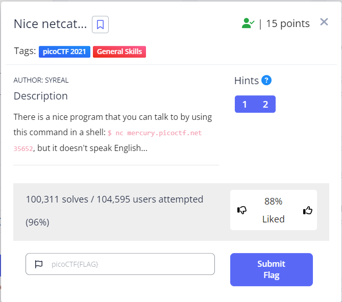

# Static ain't always noise

Category : General Skills

Point : 20 



## Description

Can you look at the data in this binary: static? This BASH script might help!

## Solve

jadi saya dapat dua file jadi awalnya saya langsung pakai strings pada file yang pertama.

```console
┌──(rinto㉿LAPTOP-LUUOMDHF)-[~/CTF/pico/Static-aint-always-noise]
└─$ cat static 
 HH/lib64/ld-linux-x86-64.so.2GNUGNU��A+�kpl%h��B0m�'= 
                                                       Y h "libc.so.6puts__cxa_finalize__libc_start_mainGLIBC_2.2.5_ITM_deregisterTMCloneTable__gmon_start___ITM_regist � � � � � � H�H��      1�
 H��t��H���5�
8#TT 1tt$D���o�N
�� � @ @ �0@)▒  p�▒V``�^y▒�o��k���o��z▒�B��▒���� �00����        ����$$<���
����^H��H���PTL��H�
 �DH�=�
 UH��
 H9�H��tH�Z
]��f.�]�@f.�H�=�
 H�5�
 UH)�H��H��H��H��?H�H��t▒H�!
 H��t
     ]��f�]�@f.��=I
 u/H�=�  UH��t
����H����!    H�=�       �
 ]����fDUH��]�f���UH��H�=�������]�f.�DAWAVI��AUATL�%F UH�-F SA��I��L)�H�H���W���H��t 1��L��L��D��A��H��H9�u�H�[]A\A]A^A_Ðf.���H�H��Oh hai! Wait what? A flag? Yes, it's around here somewhere!8����������
                                  ���T����<��������,zRx
                                                      ����+zRx
                                                             $P��� F▒J
R                                                                     �?▒;*3$"DH��\J���A�C
D|P���eB�B▒�E �B(�H0�H8�M@r8A0A(B B▒B�x���0�
���o�`�                                     �
�
 picoCTF{d15a5m_t34s3r_f6c48608}GCC: (Ubuntu 7.5.0-3ubuntu1~18.04) 7.5.08Tt��`�
�
 �
 �  ▒@ ��
 �$�� � k  1C@ �Ji v  ���`e�▒H o0+�▒@ �:�@ � �   �"�
                                                    �crtstuff.cderegister_tm_clones__do_global_dtors_auxcompleted.7698__do_global_dtors_aux_fini_array_entryframe_dummy__frame_dummy_init_array_entrystatic.c__FRAME_END____init_array_end_DYNAMIC__init_array_start__GNU_EH_FRAME_HDR_GLOBAL_OFFSET_TABLE___libc_csu_fini_ITM_deregisterTMCloneTableputs@@GLIBC_2.2.5_edata__libc_start_main@@GLIBC_2.2.5__data_start__gmon_start____dso_handle_IO_stdin_used__libc_csu_init__bss_startmain__TMC_END___ITM_registerTMCloneTableflag__cxa_finalize@@GLIBC_2.2.5.symtab.strtab.shstrtab.interp.note.ABI-tag.note.gnu.build-id.gnu.hash.dynsym.dynstr.gnu.version.gnu.version_r.rela.dyn.rela.plt.init.plt.got.text.fini.rodata.eh_frame_hdr.eh_frame.init_array.fini_array.dynamic.data.bss.comment
```

**picoCTF{d15a5m_t34s3r_f6c48608}**
